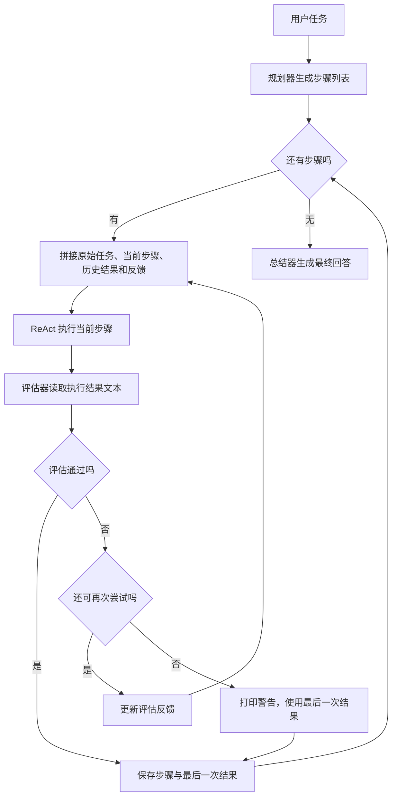

# 从 ReAct 到 Plan-and-Execute：理解 Agent 的执行、评估与重试

大模型能够生成贪吃蛇游戏的代码，但要把代码写入文件、根据执行结果继续修改，还需要工具和一段负责调度的程序。任务变长后，又可以在执行循环之外增加计划、评估和重试，让整个过程更有条理。

本文以“使用 HTML、CSS、JavaScript 编写一个简单的贪吃蛇游戏”为例，结合一套简洁的 Python 实现说明这些机制。基础执行器来自 `react_agent.py`，规划与评估流程来自 `plan_execute_agent.py`，关键代码会在文中展开，无需先阅读完整项目。

## 1、Agent 与 ReAct：根据执行结果决定下一步

对于这里的工具型 Agent，可以把它理解为三个部分的组合：**模型负责决定下一步，工具负责实际操作，主程序负责调用两者并记录结果。**

例如，模型请求读取文件，主程序执行读取函数，将内容交给模型；模型再决定如何修改，主程序执行写入操作。这个过程可以重复多轮。

ReAct 将推理与行动交替组织起来：根据已有信息选择动作，通过动作获得环境反馈，再利用反馈继续决策。这一思路来自论文 [ReAct: Synergizing Reasoning and Acting in Language Models](https://arxiv.org/abs/2210.03629)。在本文的工具调用实现中，可以用下面的循环理解它：

```text
用户任务 → 模型决策 → 工具调用 → 真实结果 → 模型再次决策
```

以贪吃蛇游戏为例，模型可能先读取已有文件，再写入游戏逻辑，最后根据检查结果修改问题。具体执行哪些动作，由模型结合当前信息决定。

当模型不再请求工具时，执行器返回回答。不过，“模型已经回答”与“任务已经正确完成”是两个不同的判断。后文的评估模块会在执行器返回后，再检查一次结果。

## 2、tool_calls 如何驱动执行循环

### 2.1 从调用请求到真实函数

基础执行器 `ReactAgent` 注册了三个工具：

| 工具 | 作用 |
| --- | --- |
| `read_file(file_path)` | 读取文件内容 |
| `write_to_file(file_path, content)` | 将内容写入文件 |
| `run_terminal_command_with_confirm(command)` | 经用户确认后执行终端命令 |

这些工具本质上是普通 Python 函数。构造执行器时，代码将它们保存为“函数名到函数对象”的字典：

```python
self.tools = {tool.__name__: tool for tool in tools}
```

`build_tool_schemas()` 则读取函数名称、文档字符串和参数签名，生成工具描述。模型请求通过 `tools` 字段携带这些描述，并设置 `tool_choice="auto"`，让模型决定是否需要调用工具。

假设模型希望读取页面，一次调用请求可以表示为：

```json
{
  "role": "assistant",
  "content": null,
  "tool_calls": [
    {
      "id": "call_read_page",
      "type": "function",
      "function": {
        "name": "read_file",
        "arguments": "{\"file_path\":\"/workspace/task/index.html\"}"
      }
    }
  ]
}
```

这是消息格式示例，并非实际运行记录。主程序读取 `function.name`，使用 `json.loads()` 将 `arguments` 中的 JSON 字符串解析为参数字典，再调用相应函数。

结果会作为 tool 消息加入历史，并通过 `tool_call_id` 关联原来的请求。模型下一次收到这段历史，就能根据真实文件内容决定后续操作。

### 2.2 核心循环做了什么

下面是 `ReactAgent.run()` 的主要代码，省略了日志输出：

```python
def run(self, user_input: str) -> str:
    messages = [
        {"role": "system", "content": self.build_system_prompt()},
        {"role": "user", "content": user_input},
    ]

    while True:
        message = self.model.chat(messages, tools=self.build_tool_schemas())
        tool_calls = message.get("tool_calls") or []
        content = message.get("content") or ""

        if not tool_calls:
            return content.strip()

        messages.append(message)
        for tool_call in tool_calls:
            tool_name, arguments = self.parse_tool_call(tool_call)
            observation = self.execute_tool(tool_name, arguments)
            messages.append({
                "role": "tool",
                "tool_call_id": tool_call["id"],
                "content": observation,
            })
```

`self.model` 是封装模型请求的 `DeepSeekClient`。它返回模型响应中的 `choices[0].message`，执行器再检查这条消息是否包含 `tool_calls`。

如果包含工具调用，就先保存 assistant 消息，随后逐个执行工具，并保存对应结果；如果没有工具调用，就返回回答文本。因此，同一个 `run()` 内部可能进行多次模型请求，也可能执行多个工具。

`parse_tool_call()` 会检查工具是否已注册，以及解析后的参数是否为字典。`execute_tool()` 使用 `self.tools[tool_name](**arguments)` 执行函数，工具抛出的异常会被转成文本反馈给模型。工具调用解析错误和模型请求异常则会向外抛出，不会自动进入后文的评估重试。

需要注意，当前循环没有轮数上限，也没有在结束前自动验证任务是否成功。它提供的是“使用工具处理一个输入，最后返回文字结果”的能力，外层流程可以在此基础上继续组织工作。

## 3、Plan-and-Execute 如何复用 ReAct

如果把“完成一个贪吃蛇游戏”直接交给执行器，它需要在每轮调用中自行决定任务如何推进。另一种组织方式是：先生成一个整体计划，再让执行器逐步处理。

这就是 Plan-and-Execute 的基本思路。在这套实现中，还增加了单步评估和有限重试，完整流程是：

```text
生成计划 → 执行当前步骤 → 评估结果
                         ├─ 通过：进入下一步
                         └─ 未通过：带反馈再次尝试当前步骤
所有步骤处理结束 → 总结结果
```

它由五个类协作完成：

| 类 | 职责 |
| --- | --- |
| `PlannerAgent` | 根据原始任务生成步骤列表 |
| `ReactAgent` | 使用工具完成当前步骤，返回文字结果 |
| `StepEvaluator` | 判断这次结果是否满足当前步骤，并给出反馈 |
| `FinalSummarizer` | 根据各步骤结果生成最终回答 |
| `EvaluationOrchestrator` | 按顺序调用上述模块，控制步骤推进和尝试次数 |

这些名称表示不同职责，不要求使用不同的大模型。实际入口创建了一个 `DeepSeekClient`，规划器、执行器、评估器和总结器都使用这个客户端。

组装流程的关键代码如下，其中 `model` 是客户端实例，`project_dir` 是目标目录：

```python
planner = PlannerAgent(model)
executor = ReactAgent(
    tools=[read_file, write_to_file, run_terminal_command_with_confirm],
    model=model,
    project_directory=project_dir,
)
evaluator = StepEvaluator(model)
summarizer = FinalSummarizer(model)

agent = EvaluationOrchestrator(
    planner=planner,
    executor=executor,
    evaluator=evaluator,
    summarizer=summarizer,
    max_retries_per_step=3,
)
```

这里最重要的组合关系是：**外层编排器决定当前执行哪一个步骤，内层 ReAct 决定完成这一步需要调用哪些工具。**

例如，外层选择“实现移动、食物和碰撞逻辑”这一步后，内层可能先读取脚本，再写入修改，最后执行检查。一次步骤执行并不等于一次模型请求，而可能包含整个工具调用循环。

## 4、计划如何生成，步骤之间如何传递信息

### 4.1 计划就是一个字符串列表

`PlannerAgent.make_plan()` 将原始任务发给模型，要求只输出包含 `steps` 的 JSON。对于贪吃蛇任务，一个可能的计划是：

```json
{
  "steps": [
    "创建游戏页面和样式",
    "实现蛇的移动、食物生成、计分和碰撞逻辑",
    "检查游戏功能并说明运行方式"
  ]
}
```

实际步骤由模型生成，上面的内容只是示例。程序解析结果的主要逻辑如下，`prompt` 是包含任务与输出格式要求的提示词：

```python
message = self.client.chat([{"role": "user", "content": prompt}])
data = json.loads(message.get("content") or "{}")
steps = data.get("steps")

if not isinstance(steps, list) or not all(
    isinstance(step, str) and step.strip() for step in steps
):
    raise RuntimeError(f"计划格式不正确：{data}")

return [step.strip() for step in steps]
```

规划调用没有传入工具，因此只生成计划，不执行文件操作。主程序得到的也只是 `List[str]`：按列表顺序逐步执行，没有额外的步骤依赖结构。

这样的设计足以说明 Plan-and-Execute 的核心机制。步骤是否具体、拆分是否合理，会直接影响后续执行。例如，“编写游戏”几乎等于重复原始任务；“实现移动、食物、计分和碰撞逻辑”则更清楚地限定了当前阶段。

格式检查也有明确边界：它检查列表和非空字符串，但不判断计划是否合理，而且当前允许空列表。模型返回非法 JSON 时，规划会失败；“只输出 JSON”的提示要求本身没有配套的自动修复逻辑。

### 4.2 执行下一步，不能只传一句步骤描述

假设页面已经创建完成，接下来需要实现游戏逻辑。如果只把“实现蛇的移动、食物生成、计分和碰撞逻辑”交给执行器，它未必知道页面文件在哪里、已有元素叫什么。

为此，编排器用 `final_results` 保存前面步骤的结果：

```python
final_results.append((step, step_result))
```

每个元素是一个二元组，分别存放步骤描述和执行器最后返回的文字。执行当前步骤之前，`_build_step_input()` 将四部分内容拼接起来：原始任务、当前步骤、之前步骤结果，以及上一次尝试的反馈。

例如，第二步第一次执行时，输入可能是：

```text
原始任务：使用 HTML、CSS、JS 写一个简单的贪吃蛇游戏。

当前步骤：实现蛇的移动、食物生成、计分和碰撞逻辑。

之前步骤结果：
- 已完成步骤：创建游戏页面和样式
  结果：已创建 index.html 和 style.css，页面包含游戏区域和分数展示。

请只完成当前步骤，并在步骤完成后简短说明结果。
```

最后这句要求用于引导执行器聚焦当前步骤。它不是程序层面的行为限制，但能让执行器知道自己正在处理一个整体任务中的局部工作。

### 4.3 传递的是结果文本，不是完整历史

`ReactAgent.run()` 每次开始都会重新创建 `messages`，因此不同步骤之间不会自动共享上一轮的完整工具调用记录。编排器传给下一步的是保存在 `final_results` 中的结果文本。

这意味着，执行器的最终说明会影响下一步获得的信息。只回答“已完成”，后续步骤能利用的信息很少；如果说明生成了哪些文件、关键元素或函数是什么、是否存在未完成内容，下一步就更容易接着工作。

文件本身仍然保存在磁盘上，执行器可以再次调用读取工具查看实际内容。于是，这套实现通过两种方式连接步骤：结果文本提供工作概况，文件工具提供需要核实的具体内容。

同一步骤重试时也会开启新的 `run()`。当前代码会传入最近一次评估反馈，但不会自动传入该步骤上一次尝试的全部对话，甚至不会单独附上上一次的 `step_result`。已有文件修改仍然存在，重试也不会自动回滚它们。

## 5、评估与重试：两层循环如何配合

计划告诉执行器该做什么，评估则在执行器返回之后，检查它是否完成了当前步骤。

### 5.1 评估器实际看到了什么

`StepEvaluator.evaluate()` 接收三个参数：原始任务 `task`、当前步骤 `step` 和执行结果 `result`。它把这些内容放进提示词，要求模型返回：

```json
{
  "passed": false,
  "feedback": "结果中没有说明是否实现了蛇与自身碰撞的处理，请检查并补充。"
}
```

`passed` 表示是否通过，`feedback` 用于指导下一次尝试。评估器没有调用工具，也不会自动打开游戏、读取文件或运行测试；它看到的是执行器返回的文字结果。

因此，上例中的反馈可以说明“结果描述缺少某项信息”，但仅凭缺少说明，不能认定实际代码一定没有该功能。下一次执行需要查看实际实现，再决定是补充功能、运行检查，还是补充说明。

把评估器独立出来，可以让模型按照“检查当前步骤”的职责再判断一次。不过，执行器和评估器共用同一客户端，并不会因此获得彼此独立的事实来源。评估质量仍取决于输入中的信息是否准确、充分。

### 5.2 未通过后，反馈怎样回到执行器

编排器获取评估结果后，如果 `passed` 为真，就结束当前步骤的尝试；否则，将 `feedback` 用于重新构造输入：

```text
原始任务：使用 HTML、CSS、JS 写一个简单的贪吃蛇游戏。

当前步骤：实现蛇的移动、食物生成、计分和碰撞逻辑。

之前步骤结果：
- 已完成步骤：创建游戏页面和样式
  结果：已创建页面与样式，页面包含游戏区域和分数展示。

上一次尝试的反馈：
结果中没有说明是否实现了蛇与自身碰撞的处理，请检查并补充。

请只完成当前步骤，并在步骤完成后简短说明结果。
```

原始任务和当前步骤没有改变，新增的是具体反馈。执行器可以据此读取当前脚本，确认是否存在自身碰撞判断，必要时修改，再返回新的结果。

这就是重试的实际机制：**根据评估反馈，重新调用执行器处理同一个步骤。** 它不会自动重新生成整体计划，也不是把同一次模型请求原样发送一遍。

### 5.3 编排器中的两个循环

下面是 `EvaluationOrchestrator.run()` 的主要逻辑，省略了进度日志，保留了最终未通过时的处理：

```python
def run(self, task: str) -> str:
    steps = self.planner.make_plan(task)
    final_results = []

    for idx, step in enumerate(steps, 1):
        passed = False
        feedback = ""
        step_result = ""

        for attempt in range(1, self.max_retries + 1):
            step_input = self._build_step_input(
                task, step, final_results, feedback
            )
            step_result = self.executor.run(step_input)
            evaluation = self.evaluator.evaluate(task, step, step_result)

            if evaluation.get("passed"):
                passed = True
                break
            else:
                feedback = evaluation.get("feedback", "步骤未完成，请改进")

        if not passed:
            print(f"警告：步骤 {idx} 在 {self.max_retries} 次重试后仍未通过，使用最后的结果继续。")

        final_results.append((step, step_result))

    return self.summarizer.summarize(task, final_results)
```

外层 `for` 按顺序遍历计划，内层 `for` 控制当前步骤的尝试次数。每次内层循环调用一次 `executor.run()`，而这个方法内部又有自己的 ReAct 工具调用循环。

可以从三个层次理解它们：

| 层次 | 循环处理什么 | 何时结束 |
| --- | --- | --- |
| 计划遍历 | 计划中的各个步骤 | 所有步骤都被处理过 |
| 当前步骤的尝试 | 执行一次，再评估一次 | 评估通过或达到尝试上限 |
| ReAct 执行 | 请求模型、执行工具、反馈结果 | 模型不再请求工具 |

代码中的 `max_retries_per_step=3` 最终对应 `range(1, 4)`，所以每步最多执行三次，包含第一次尝试。虽然参数和警告使用了“重试”这个词，实际不是首次执行之后再重试三次。

同时，这个上限约束的是 `executor.run()` 被调用的次数，并没有限制每次 `run()` 内部的模型请求数。理解这一区别，才能准确理解“三次尝试”控制了什么。

### 5.4 达到上限仍未通过，会发生什么

这套实现选择打印警告，使用最后一次结果继续后面的步骤。即使 `passed` 仍为假，也会执行 `final_results.append((step, step_result))`。

因此，计划遍历结束只表示每一步都已经被处理过，并不表示每一步都通过了评估。如果游戏逻辑始终没有完成，后续检查步骤仍然会执行；前面的缺失可能继续影响后面的结果。

此外，`final_results` 只保存步骤描述和最后一次结果，没有单独保存是否通过、尝试次数或评估反馈。`_build_step_input()` 又把其中的记录统一称为“已完成步骤”，所以后续输入里的这个名称不能视为严格的通过标记。

这是代码为了保持流程简单而采用的处理方式。阅读时应按实际行为理解它，不能把它解释成“失败后停止”或“所有步骤通过后才总结”。

### 5.5 评估结果也可能出错

评估器会捕获 JSON 解析错误，将其转换为 `passed=False` 和“评估器返回格式错误”的反馈。但它没有完整校验解析后对象的结构和字段类型。

例如，编排器使用 `if evaluation.get("passed")` 判断通过。如果模型错误地返回字符串 `"false"`，Python 会把这个非空字符串视为真值。若返回的合法 JSON 不是对象，后续调用 `.get()` 也可能失败。

这里需要区分“评估未通过”和“程序发生异常”：前者会进入内层的再次尝试，后者并不一定被捕获，可能直接中断运行。代码中的有限重试主要围绕评估反馈展开，并不是覆盖所有错误的通用重试机制。

## 6、把整个过程串起来：从计划到最终回答

下面通过一段假设的执行过程，说明前面的模块如何协作。计划和反馈均为示意，不代表一次真实运行结果。

| 阶段 | 执行与反馈 | 编排器的下一步 |
| --- | --- | --- |
| 生成计划 | 模型返回“创建页面”“实现逻辑”“检查并说明运行方式”三个步骤 | 开始第一步 |
| 创建页面 | 执行器写入页面与样式，返回文件和页面结构说明；评估通过 | 保存结果，进入第二步 |
| 实现逻辑，第一次尝试 | 执行器返回结果；评估指出没有说明自身碰撞的处理 | 将反馈加入输入，再次执行第二步 |
| 实现逻辑，第二次尝试 | 执行器读取当前脚本，检查或补充碰撞处理，返回新的说明；评估通过 | 保存第二次结果，进入第三步 |
| 检查并说明运行方式 | 执行器使用已注册工具处理检查任务，返回结果；评估通过 | 保存结果，调用总结器 |
| 最终总结 | 总结器读取原始任务和三个步骤的结果文本 | 生成面向用户的最终回答 |

可以看到，第一步的结果影响第二步获得的上下文，第二步的评估反馈影响它自己的再次尝试，而第二步最终保留下来的结果又会传给第三步。



### 总结器拿到哪些信息

`FinalSummarizer.summarize()` 把每个 `(step, result)` 拼成文本，再连同原始任务发送给模型。它的输入可以理解为：

```text
用户原始任务：编写一个简单的贪吃蛇游戏。

执行记录：
1. 步骤：创建游戏页面和样式
   结果：页面与样式的完成说明……
2. 步骤：实现游戏逻辑
   结果：最后一次执行的逻辑实现说明……
3. 步骤：检查并说明运行方式
   结果：检查与运行说明……
```

总结器没有工具调用，也没有在这个阶段重新验收游戏。它负责整理已有结果，不能自动弥补之前遗漏的验证。如果某一步多次未通过，但最后的结果文本没有如实说明问题，总结器也未必能从输入中发现这一点。

### 理解工具能力，才能理解结果的可信范围

当前执行器注册的是文件读写和终端命令工具，没有直接注册浏览器检查工具。执行器可以请求运行命令，但具体能否完成某种检查，取决于运行环境和可用程序，不能假定每次执行都会自动打开游戏验证交互。

终端工具还有一个实际限制：底层函数只返回标准输出，没有返回标准错误和退出码。命令失败时，模型可能只收到空文本，因此不能把“没有输出”当作“检查通过”。用户拒绝命令后，工具则返回拒绝信息，ReAct 会继续把它交给模型处理。

这些细节说明，评估结果建立在执行器能够获得并报告的信息之上。要提高可靠性，可以先从准确返回工具结果、清楚报告检查情况入手，而不必立即引入复杂的编排机制。

## 7、评估重试与动态重规划有什么区别

本文实现的是：先生成一个计划，按顺序执行，每步结束后评估，未通过则带反馈再次尝试。初始的 `steps` 列表只生成一次，后续没有修改它的逻辑。

因此，执行器可以根据反馈改变完成当前步骤的方法，但外层计划不会随之自动变化。这就是评估重试与动态重规划的区别。

例如，“缺少自身碰撞处理，请检查并补充”，是在同一个步骤内继续完善；如果发现已经有完整游戏，只需修复一个输入问题，希望取消原来“创建页面、实现游戏逻辑”的安排，就需要重新生成或调整剩余计划，这才属于动态 Replan。

动态重规划可以作为 Plan-and-Execute 的扩展，但当前代码没有 Replanner，也没有对应的计划更新流程。理解本文这套实现时，重点仍是规划器、执行器、评估器和总结器如何通过编排器连接起来。

ReAct 提供根据反馈连续调用工具的能力；Plan-and-Execute 把整体任务拆成步骤；单步评估再为执行器增加一次检查和改进的机会。它们在这套代码中的组合并不复杂，关键是看清每次调用的输入、输出，以及哪一个循环决定继续或结束。

顺着“任务 → 计划 → 当前步骤输入 → 执行结果 → 评估反馈 → 下一次尝试或下一步 → 最终总结”这条线阅读，就能理解 Agent 如何从一次模型回答，扩展成一个能够分阶段执行任务的程序。
