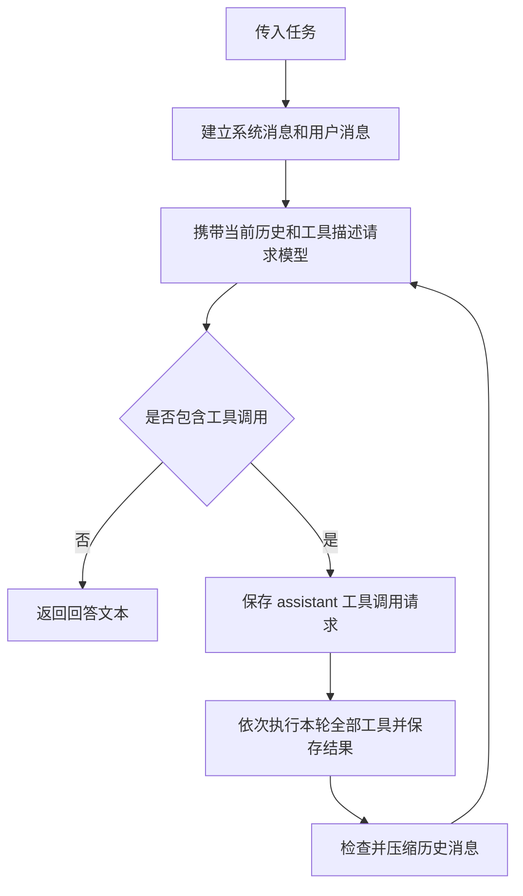
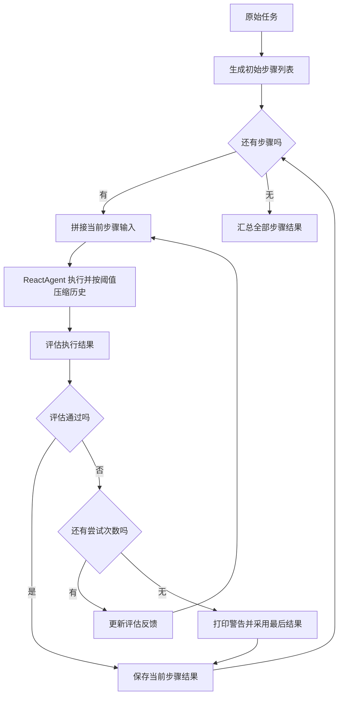

# 从代码理解 ReAct 与 Plan-and-Execute

本项目使用 DeepSeek Chat Completions API 和本地 Python 工具完成任务。两个入口都以“使用 HTML、CSS、JavaScript 编写贪吃蛇小游戏”为任务：`react_agent.py` 直接执行任务，`plan_execute_agent.py` 先生成计划，再逐步执行、评估和总结。

本文按代码中的调用顺序说明实现。

| 文件 | 职责 |
| --- | --- |
| `constants.py` | 配置模型名称、接口地址和 API 密钥 |
| `tools.py` | 提供文件读取、文件写入和需要用户确认的终端命令工具 |
| `react_agent.py` | 封装模型请求，实现工具调用循环和记忆压缩 |
| `plan_execute_agent.py` | 规划步骤，调用执行器，评估并重试，最后汇总结果 |
| `test_react_agent.py` | 使用模拟模型验证记忆压缩及执行循环 |

## 1、配置与运行入口

使用 Python 3.9 或以上版本。在项目根目录安装依赖，并创建任务输出目录：

```bash
python -m pip install requests
mkdir -p task
```

在 `constants.py` 中填写 `CHAT_COMPLETIONS_API_KEY`。客户端直接读取以下常量：

| 常量 | 当前配置 |
| --- | --- |
| `DEFAULT_MODEL` | `deepseek-v4-flash` |
| `CHAT_COMPLETIONS_URL` | `https://api.deepseek.com/chat/completions` |
| `CHAT_COMPLETIONS_API_KEY` | 默认为空，需要填写 |

运行基础执行器：

```bash
python react_agent.py
```

运行带规划和评估的流程：

```bash
python plan_execute_agent.py
```

两个入口都使用 `os.path.abspath("task")` 作为项目目录，并在代码中设置固定的 `task` 字符串。更换任务时修改入口中的 `task`。终端中的交互输入用于确认命令是否执行。

`react_agent.py` 的入口依次创建客户端、注册工具、构造 Agent，再调用 `run()`：

```python
project_dir = os.path.abspath("task")
model_name = DEFAULT_MODEL

model = DeepSeekClient(model_name)
agent = ReactAgent(
    tools=[read_file, write_to_file, run_terminal_command_with_confirm],
    model=model,
    project_directory=project_dir,
)

task = "使用html、js、css写一个贪吃蛇小游戏"
final_answer = agent.run(task)
print(f"\n最终回答：{final_answer}")
```

## 2、DeepSeekClient：请求模型

`DeepSeekClient` 在初始化时保存模型名称并读取 API 密钥。`chat()` 使用 `requests.post()` 请求配置的接口，请求体包含 `model` 和 `messages`；传入非空工具列表时，再加入 `tools` 和 `tool_choice="auto"`。

请求超时参数为 600 秒。客户端检查 HTTP 状态，解析响应 JSON，并返回 `choices[0].message`。HTTP 状态检查失败或响应解析、取值失败时，会抛出带错误信息的异常。

执行器使用带工具描述的请求，让模型决定是否调用工具。记忆压缩、规划、评估和最终总结都通过同一个 `chat()` 方法请求文本，不传入工具列表。

## 3、ReactAgent：执行工具并继续对话

### 3.1 初始化工具和消息

`ReactAgent` 接收工具列表、模型客户端和项目目录。工具按函数名保存为字典，项目目录转换为绝对路径。

每次调用 `run(user_input)`，都会新建消息列表，最初包含两条消息：

1. `system`：由 `build_system_prompt()` 生成，说明工具使用方式、文件操作目录以及直接回答的条件。
2. `user`：本次传入的任务原文。

项目目录通过提示词告诉模型。文件工具直接使用传入的路径，终端工具使用启动进程的工作目录，因此运行示例时应从项目根目录启动。

### 3.2 把函数转换为工具描述

`build_tool_schemas()` 遍历注册的函数，使用 `inspect.signature()` 读取参数，用 `inspect.getdoc()` 读取函数说明，再生成 API 接受的 function tool schema。

每个参数的类型统一设为 `string`，没有默认值的参数加入 `required`。这与当前注册工具的字符串参数对应。

模型返回工具调用后，`parse_tool_call()` 读取函数名，用 `json.loads()` 解析参数，检查工具是否已注册、参数是否为字典。`execute_tool()` 再通过 `self.tools[tool_name](**arguments)` 执行本地函数。

### 3.3 工具的实际行为

两个入口注册相同的三个工具：

| 工具 | 执行行为 |
| --- | --- |
| `read_file(file_path)` | 以 UTF-8 读取文件并返回完整文本 |
| `write_to_file(file_path, content)` | 以 UTF-8 写入文件，覆盖已有内容，成功时返回“写入成功”；父目录需要事先存在 |
| `run_terminal_command_with_confirm(command)` | 用户输入 `y` 或 `Y` 后，通过 `subprocess.run(..., shell=True)` 执行命令并返回 `stdout`；其他输入返回“用户拒绝执行终端命令。” |

终端命令的 `stderr` 和退出码没有包含在工具返回值中。用户拒绝命令后，拒绝信息仍作为工具结果交给模型，执行循环继续。

`tools.py` 还定义了 `web_search()`，其返回值是模拟搜索文本，两个入口均未注册它。

### 3.4 执行循环

`run()` 每轮把当前消息和工具描述传给模型，再检查返回的 `tool_calls`：

1. 没有工具调用时，返回去除首尾空白的 `content`，本次运行结束；空内容也会结束。
2. 有工具调用时，先把完整 assistant 消息加入历史。
3. 按顺序解析并执行本轮的每个工具调用。
4. 将每个结果作为 `role="tool"` 的消息加入历史，用 `tool_call_id` 对应原调用。
5. 本轮全部工具执行完成后，调用 `compress_memory()` 检查是否压缩历史，再进入下一轮模型请求。

日志只显示每次工具结果的前 500 个字符，加入消息历史的仍是完整结果。工具函数抛出的异常会被转换为“工具执行失败：……”交给模型；工具调用解析错误和主执行请求中的模型接口异常则向外抛出。



## 4、记忆压缩：达到 10 条消息时生成摘要

`run()` 在一轮工具调用全部完成后调用 `compress_memory()`。消息总数少于 10 条时保持原样；达到 10 条时，使用同一个模型总结任务执行进展，保留关键结果和待办事项。摘要请求不传入工具列表。

压缩后，消息列表只保留三条：原始系统提示、原始用户任务，以及一条历史执行摘要。下一轮模型请求使用这三条消息继续执行。

计数包含系统消息、用户消息、assistant 消息和每条工具结果。例如，初始有 2 条消息，每轮调用一个工具会新增 2 条；执行 4 轮后达到 10 条，压缩为 3 条。

后续消息再次达到 10 条时，已有摘要和新记录一起重新总结。每次调用 `run()` 都会新建消息列表。

## 5、Plan-and-Execute：规划、执行、评估与重试

### 5.1 入口组装

`plan_execute_agent.py` 创建一个 `DeepSeekClient`，传给规划器、执行器、评估器和总结器，再由 `EvaluationOrchestrator` 组织调用。

| 模块 | 类或方法 | 输入与输出 |
| --- | --- | --- |
| 规划 | `PlannerAgent.make_plan()` | 接收原始任务，返回字符串步骤列表 |
| 执行 | `ReactAgent.run()` | 接收当前步骤及上下文，通过工具执行并返回文本结果 |
| 评估 | `StepEvaluator.evaluate()` | 接收原始任务、当前步骤和结果，返回评估 JSON |
| 总结 | `FinalSummarizer.summarize()` | 接收任务及各步骤结果，返回最终文本 |
| 编排 | `EvaluationOrchestrator.run()` | 顺序调用上述模块，控制每个步骤的尝试次数 |

执行器使用第 3、4 节中的工具循环和记忆压缩逻辑。

### 5.2 生成初始步骤

`PlannerAgent.make_plan()` 要求模型输出含 `steps` 字段的 JSON。代码用 `json.loads()` 解析，检查 `steps` 是否为列表、每项是否为非空字符串，再去掉每项两端的空白。

空步骤列表可以通过校验，此时编排器直接进入总结。非法 JSON 或不符合校验要求的步骤会使规划失败。

### 5.3 执行当前步骤并评估

编排器按初始计划依次处理步骤。每次尝试前，`_build_step_input()` 拼接原始任务、当前步骤、之前步骤的结果和最近一次评估反馈，并要求执行器只完成当前步骤。

执行器返回文本后，`StepEvaluator.evaluate()` 将原始任务、当前步骤和执行结果交给模型，要求返回 `passed` 和 `feedback` 字段。评估器根据结果文本判断；其请求不带工具。

编排器通过 `evaluation.get("passed")` 判断是否通过。通过后结束当前步骤的尝试；未通过则取出 `feedback`，用于下一次执行输入。非法 JSON 会转换为不通过及“评估器返回格式错误”的反馈。合法 JSON 直接返回，`passed` 使用 Python 真值判断。

### 5.4 尝试次数与步骤结果

`max_retries_per_step` 默认值为 3。实际循环为 `range(1, self.max_retries + 1)`，因此每步最多执行 3 次，包含第一次尝试。

达到上限仍未通过时，编排器打印警告，保存最后一次结果，继续下一个步骤。结果列表保存的是 `(步骤, 结果文本)`，后续步骤会通过“之前步骤结果”接收这些记录。

每次尝试都会重新调用 `ReactAgent.run()`，其消息历史和压缩摘要会重新开始；跨尝试传递的内容来自编排器构造的输入。工具已经写入的文件仍保留在磁盘上。



### 5.5 最终总结

遍历完步骤后，`FinalSummarizer.summarize()` 将各步骤及其结果拼成执行记录，与原始任务一起传给模型。它返回去除首尾空白的文本，由入口打印为最终回答。

## 6、测试

在项目根目录执行：

```bash
python -m unittest -v test_react_agent
```

测试使用模拟模型和简单工具，不请求真实模型接口，验证少于 10 条消息时保持历史，以及达到 10 条后生成摘要并继续执行。
